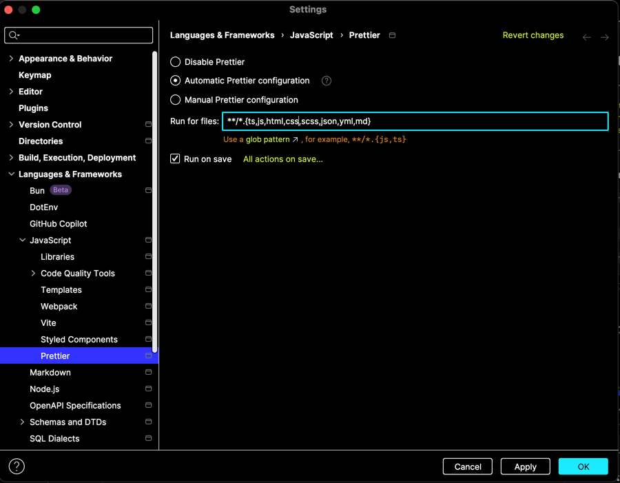
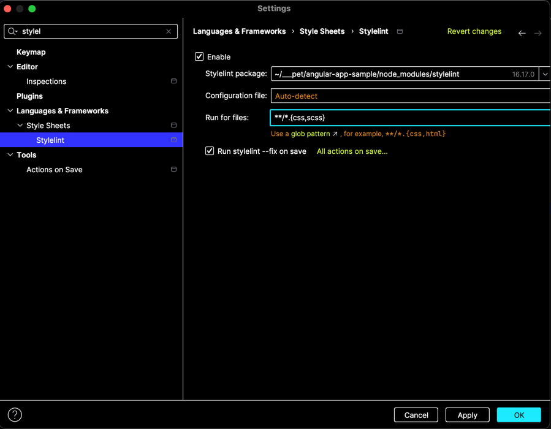

# Angular app sample

---

- [🚀 Init](#-init)
- [✨ Prettier setup](#-prettier-setup)
- [✨ ESLint setup](#-eslint-setup)
- [✨ Stylelint setup](#-stylelint-setup)

---

### 🚀 Init

- run `npm run init`
- run `npm install`
- remove `init` command from `package.json`
- remove `tools/init-project.js`
- replace README.md content with your own

---

### ✨ Prettier setup

- `cmd + ,`
- search `Prettier`
- enable `Automatic Prettier configuration`
- insert `**/*.{ts,js,html,css,scss,json,yml,md}`
- enable `Run on save`
- `Apply` / `OK`

  
🎆 Screenshot

    
  

---

### ✨ ESLint setup

- `cmd + ,`
- search `ESLint`
- enable `Automatic ESLint configuration`
- insert `**/*.{ts,js,html,json,yml,md}`
- enable `Run eslint --fix on save`
- `Apply` / `OK`

  
🎆 Screenshot

  

---

### ✨ Stylelint setup

- `cmd + ,`
- search `Stylelint`
- enable `Enable`
- insert `**/*.{css,scss}`
- enable `Run stylelint --fix on save`
- `Apply` / `OK`

  
🎆 Screenshot

  

---
